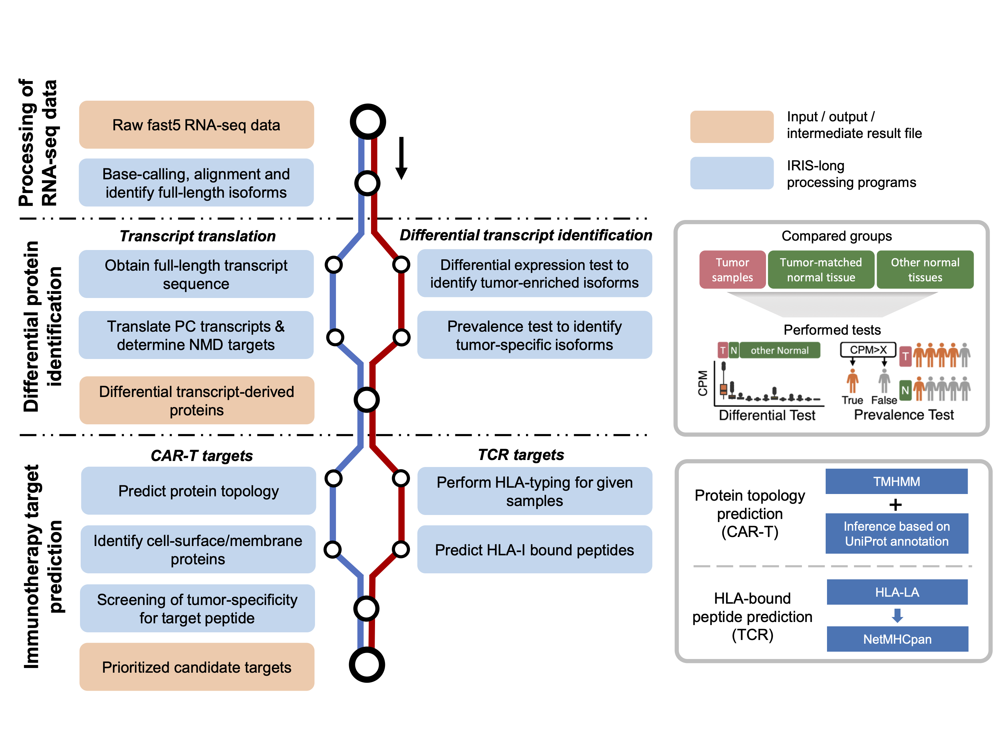

## IRIS-long: Isoform peptides from RNA splicing for Immunotherapy target Screening - based on Long-read RNA-seq data

## Table of Contents

* [Overview](#overview)
* [Dependencies](#dependencies)
* [Usage](#usage)
  + [Data combining (optional)](#data-combining)
  + [Data processing](#data-processing)
  + [Data visualization and analysis](#data-visualization-and-analysis)
  + [Differential test](#differential-test)
  + [Transcript Translation](#transcript-translation)
  + [CAR-T target prediction](#car-t-target-prediction)
  + [TCR target prediction](#tcr-target-prediction)


## Overview

IRIS-long tool is designed to work with transcript-level quantification result based on long-read RNA-seq data. If you start with fast5 raw files, please refer to [ESPRESSO GitHub page](https://github.com/Xinglab/espresso) and [TEQUILA-seq GitHub page](https://github.com/Xinglab/TEQUILA-seq) for the transcript identification and quantification; during which, Guppy (Basecalling), [minimap2](https://github.com/lh3/minimap2) (Alignment) and [ESPRESSO](https://github.com/Xinglab/espresso) (Quantification) tool might be used.



The goal of IRIS-long tool is to discover novel tumor antigen from RNA dysregulation for immunotherapy. Here are the short descriptions for each step:

1. **Data combining (Optional)**: If you want to compare the quantification result from multiple (ESPRESSO) runs, this step needs to be performed firstly. Since one novel transcript identified by ESPRESSO tool might be assigned for different transcript IDs in different runs, we need to collapse those IDs into a single ID, and then combine transcript abudance matrixes and gtf files from different runs into a single abundance matrix and a single gtf file.
2. **Data processing**: Base on the transcript raw abundance matrix, we could normalize it (either by sam files or abundance matrix itself) into a abundance matrix using CPM as unit. Then this step also generates transcript proportion matrix as well as some other files that are necessary for the following steps. 
3. **Data visualization and analysis**: This step is required to be run before "CAR-T target prediction" / "TCR target prediction" step. And most importantly, it will generate a `Template_to_generate_figures.sh` file, which could generate expected figures when interested gene and transcript are specified.
4. **Differential test**: This step is to perform differential tests between tumor samples and normal tissue samples. This step consists of two test (based on transcript level): differential expression test (two-sided wilcoxon-ranksum test) and prevalence test (fisher-exact test). 
5. **Transcript Translation**: This step is to translate all identified transcripts into potential protein products. During this step, all transcripts annotated as "protein-coding" and with "basic" tag (from GENCODE annotation) would be translated using their annotated Open Reading Frame (ORF); then, all the transcripts that are not considered as the target of Nonsense-Mediated Decay (NMD) would be translated using their longest ORF.
6. **CAR-T target prediction**: During this step, we would predict the topology of proteins first to decide whether it can be presented at cell surface, by using both TMHMM tool and a customized inference medtho by borrowing information from UniProt annotation. Then we would combine predicted cell-surface proteins result with previous differential transcripts result, and adopt a tumor-specificty scanning strategy to prioritize the final targets for CAR-T therapy.
7. **TCR target prediction**: During this step, we would perform HLA-typing based on given samples first. Then we would predict the peptides bound by sample-specific HLA complex. Finally, we adopt a tumor-specificty scanning strategy to prioritize the final targets for TCR therapy.


## Dependencies

To run our scripts, the following dependencies will need to be installed and available on `$PATH`:

* [SAMtools](http://samtools.sourceforge.net) 
* [TMHMM](https://services.healthtech.dtu.dk/services/TMHMM-2.0/)
* [HLA-LA](https://github.com/DiltheyLab/HLA-LA) 
* [NetMHCpan](https://services.healthtech.dtu.dk/services/NetMHCpan-4.1/) 
* [Python](https://www.python.org/) >3.8
  + [NumPy](https://numpy.org/) 
  + [ConfigArgParse](https://pypi.org/project/ConfigArgParse/) 
  + [SciPy](https://scipy.org/) 
  + [statsmodels](https://www.statsmodels.org/) 
  + [BioPython](https://biopython.org/) 
  + [Matplotlib](https://matplotlib.org/)
* [R](https://www.r-project.org/) 
  + [ggplot2](https://ggplot2.tidyverse.org/)
  + [tidyverse](https://www.tidyverse.org/)
  + [ggplotify](https://cran.r-project.org/package=ggplotify)
  + [scales](https://scales.r-lib.org/)
  + Check for thread support with `perl -e 'use threads; print("ok\n")'`

## Usage

### Data combining

This sub-command is used to combine ESPRESSO results from different runs. The command can start from raw ESPRESSO gtf and ESPRESSO abundance matrix and it will generate combined gtf file and combined isoform abundance matrix.

Our script can be run as follows:

```
python /mnt/isilon/xing_lab/aspera/xuy/snakemake_ESPRESSO_reference/pipeline_test/IRIS_long/IRIS_long_main.py Combine [-h] \
--gtf_list /path/to/espresso_gtf_file/list \
--outf_dir /path/to/folder/of/output/file

script arguments:
    -h, --help                                          Show this message and exit

    --gtf_list                                          Path to espresso_gtf_file list

    --outf_dir                                          Folder of output 

```

`gtf_list` lists ESPRESSO gtf files from different runs. 

An example `gtf_list` file would be:
```
./samples_N2_R0_updated.gtf    Tumor
/mnt/isilon/xing_lab/aspera/xuy/CloneTechTissueAll_ESPRESSO_0225/samples_N2_R0_updated_hg38.gtf    Tissue
```
Note: columns are separated by `tab`. 


### Data processing

This sub-command is used to pre-process ESPRESSO results. The command can start from raw ESPRESSO gtf and ESPRESSO abundance matrix and it will generate bed format file (derived from gtf file) as well as normalized abundance matrix using CPM as unit in both transcript level and gene level. Besides, it will also generate isoform proportion matrix, which would be used in the following steps

Our script can be run as follows:

```
python /mnt/isilon/xing_lab/aspera/xuy/snakemake_ESPRESSO_reference/pipeline_test/IRIS_long/IRIS_long_main.py Preprocess [-h] \
--espresso_gtf /path/to/espresso_gtf_file \
--espresso_abundance /path/to/espresso_abundance_matrix_file \
--normalized_mode /choose/from/'SAM'/or/'ESPRESSO' \
--folder_sam /path/to/folder/of/sam_files \
--outf_dir /path/to/folder/of/output/file

script arguments:
    -h, --help                                          Show this message and exit

    --espresso_gtf                                      ESPRESSO gtf file

    --espresso_abundance                                ESPRESSO abundance file

    --normalized_mode                                   Choose to normalize CPM based on SAM files or ESPRESSO output file, choose from ['SAM','ESPRESSO']

    --folder_sam                                        Folder of sam files

    --outf_dir                                          Folder of output 

```


### Data visualization and analysis

This sub-command is required to be run before "CAR-T target prediction" or "TCR target prediction" step.

The command based on the results generated from previous step, and it will generate a bash file `Template_to_generate_figures.sh` as the output. The bar-graph figures for both isoform proportion and isoform abundance (CPM) in a gene, as well as the transcript structure figure would be generated when interested `Ensembl_Gene_ID`, `Gene_Symbol` and `Ensembl_Transcript_ID` are specified.

Our script can be run as follows:

```
python /mnt/isilon/xing_lab/aspera/xuy/snakemake_ESPRESSO_reference/pipeline_test/IRIS_long/IRIS_long_main.py Figure [-h] \
--isoform_porportion_inf /path/to/isoform/proportion/matrix \
--isoform_cpm_inf /path/to/isoform/abundance/matrix/CPM \
--group_info_inf /path/to/file/containing/group_info \
--required_trans_inf /path/to/file/containing/required_transcripts \
--bedgraph /path/to/processed/bed/file \
--outf_dir /path/to/folder/of/output/file \
--figures Isoform Single_isoform Structure

script arguments:
    -h, --help                                          Show this message and exit

    --isoform_porportion_inf                            Isoform proportion matrix from previous step

    --isoform_cpm_inf                                   Isoform abundance matrix file (CPM) from previous step

    --group_info_inf                                    Sample group information

    --required_trans_inf                                Transcripts need to show in final figure

    --bedgraph                                          Bed file generated from previous step

    --outf_dir                                          Folder of output

    --figures                                           Figures expected to generate, could be multiple choices from ['Isoform','Single_isoform','Structure'], seperated by ' ' (white space)

```

`group_info_inf` indicates how many sample groups we have, and how many samples in each group. 

An example `group_info_inf` file would be:
```
Group   Number_of_samples
Tumor   16
Tissue  30
```
Note: columns are separated by `tab`. And the order is important, based on this example, we know the first 16 samples in transcript expression matrix belong to Tumor group and the rest 30 samples are normal tissues.


`required_trans_inf` indicates what transcript we want show in the figure. In default, the five transcripts we would include are: 
1. The interested transcript
2. The canonical transcript in a gene (if it's not the interested transcript, otherwise it would be the longest annotated transcript, based on Gencode annotation)
3. The 3rd - 5th transcripts would be the transcripts with the highest average proportion across all samples among the rest transcripts in a gene. 
Thus, we need to input all the interested transcripts in  `required_trans_inf` so that they could be included in the genrated figures. 

An example `required_trans_inf` file would be:
```
Gene_ID Trans_ID  Gene_symbol
ENSG00000026508 ENST00000434472;ENST00000428726 CD44
```
Note: columns are separated by `tab`. Multiple required transcripts are separated by `;`.


### Differential test

This sub-command is used to perform differential tests between tumor samples and normal tissue samples. This step consists of two test (based on isoform level): differential expression test (two-sided wilcoxon-ranksum test) and prevalence test (fisher-exact test).

Our script can be run as follows:

```
python /mnt/isilon/xing_lab/aspera/xuy/snakemake_ESPRESSO_reference/pipeline_test/IRIS_long/IRIS_long_main.py DiffTest [-h] \
--isoform_cpm_inf /path/to/isoform_cpm_matrix \
--tumor_num /number/of/tumor/samples \
--detest_p /p-value/in/DE-test \
--detest_tumor_cpm /Cutoff/of/CPM/across/tumor/in/DE-test \
--detest_fc /Cutoff/of/fold/change/in/DE-test \
--pretest_p /p-value/in/prevalence-test \
--pretest_tumor_cpm /Cutoff/of/CPM/across/tumor/in/prevalence-test \
--pretest_tissue_cpm /Cutoff/of/CPM/across/tissue/in/prevalence-test \
--outf_dir /path/to/folder/of/output/file

script arguments:
    -h, --help                                          Show this message and exit

    --isoform_cpm_inf                                   Isoform CPM infile

    --tumor_num                                         Number of tumor samples

    --detest_p                                          Cutoff of p-value in DE test, default = 0.05

    --detest_tumor_cpm                                  Cutoff of median CPM value in tumor samples, used to decide whether an isoform is highly expressed, default = 3

    --detest_fc                                         Cutoff of fold change between tumor and normal, used to decide DE isoform, default = 2

    --pretest_p                                         Cutoff of p-value in prevalence test, default = 1e-6

    --pretest_tumor_cpm                                 Cutoff of CPM value in tumor samples, used to decide whether an isoform is considered as expressed, default = 2

    --pretest_tissue_cpm                                Cutoff of CPM value in tissue samples, used to decide whether an isoform is considered as expressed, default = 1

    --outf_dir                                          Folder of output 

```


### Transcript Translation

This sub-command is used to classify transcripts into different types (protein-coding, NMD or fragment). Then translate protein-coding transcripts into proteins.

Our script can be run as follows:

```
python /mnt/isilon/xing_lab/aspera/xuy/snakemake_ESPRESSO_reference/pipeline_test/IRIS_long/IRIS_long_main.py Translation [-h] \
--mode /short-read/or/long-read \
--trans_gtf /path/to/ESPRESSO/gtf/file \
--abundance_inf /path/to/abundance/file \
--genome_version /hg19/or/hg38 \
--ref_gtf /path/to/reference/gencode/gtf/file \
--out_file /prefix/of/name/of/output/file \
--outf_dir /path/to/folder/of/output/file

script arguments:
    -h, --help                                          Show this message and exit

    --mode                                              Long-read or short-read RNA-seq data mode, default is long-read

    --trans_gtf                                         Generated ESPRESSO gtf file

    --abundance_inf                                     Generated isoform CPM abundance file

    --genome_version                                    Choose from ['GRCH38','GRCH37','hg38','hg19']

    --ref_gtf                                           Reference gencode annotation gtf

    --out_file                                          Prefix of the name of output file

    --outf_dir                                          Folder of output 

```


### CAR-T target prediction

This sub-command is used to decide protein topology and further discover potential targets for CAR-T therapy.

Our script can be run as follows:

```
python /mnt/isilon/xing_lab/aspera/xuy/snakemake_ESPRESSO_reference/pipeline_test/IRIS_long/IRIS_long_main.py CAR_T [-h] \
--tmhmm_dir /path/of/tmhmm \
--tumor_num /number/of/tumor/samples \
--protein /path/to/generated/protein/fasta \
--abundance_inf /path/to/abundance/file \
--isoform_prop_inf /path/to/isoform/proportion/file \
--genome_version /hg19/or/hg38 \
--specificity_score /cutoff/of/specificity_score \
--tissue_cpm /cutoff/of/transcripts/in/tissue/samples \
--annotated_isoform_contri_inf /path/to/file \
--other_isoform_contri_inf /path/to/file \
--out_file /prefix/of/name/of/output/file \
--outf_dir /path/to/folder/of/output/file

script arguments:
    -h, --help                                          Show this message and exit

    --tmhmm_dir                                         File path of TMHMM tool (directory is needed)

    --tumor_num                                         Number of tumor samples

    --protein                                           Generated protein fasta file

    --abundance_inf                                     Generated isoform CPM abundance file

    --isoform_prop_inf                                  Generated isoform proportion file

    --genome_version                                    Choose from ['GRCH38','GRCH37','hg38','hg19']

    --specificity_score                                 Cutoff of specificity score (default = 1)

    --tissue_cpm                                        Cutoff of (maximam acceptable) CPM of transcripts encode given peptide in tissue samples (default = 10)

    --annotated_isoform_contri_inf                      File generated before, which ends with "_annotated_isoform_contribution.txt"

    --other_isoform_contri_inf                          File generated before, which ends with "_proportion_only_focus_others.txt"

    --out_file                                          Prefix of the name of output file

    --outf_dir                                          Folder of output 

```


### TCR target prediction

This sub-command is used to predict samples-specific HLA types and further discover potential targets for TCR therapy.

