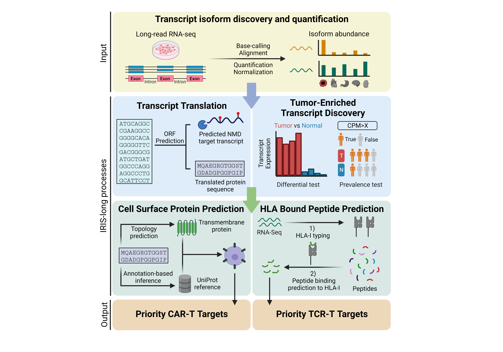

## IRIS-long: Isoform peptides from RNA splicing for Immunotherapy target Screening - based on Long-read RNA-seq data

## Table of Contents

* [Overview](#overview)
* [Dependencies](#dependencies)
* [Usage](#usage)
  + [Data combining (optional)](#data-combining)
  + [Data processing](#data-processing)
  + [Differential test](#differential-test)
  + [Transcript Translation](#transcript-translation)
  + [CAR-T target prediction](#car-t-target-prediction)
  + [TCR target prediction](#tcr-target-prediction)
  + [Example visualization](#example-visualization)
  + [Tumor specificity](#tumor-specificity)
  + [Protein topology](#protein-topology )


## Overview

IRIS-long tool is designed to work with transcript-level quantification result based on long-read RNA-seq data. If you start with fast5 raw files, please refer to [ESPRESSO GitHub page](https://github.com/Xinglab/espresso) and [TEQUILA-seq GitHub page](https://github.com/Xinglab/TEQUILA-seq) for the transcript identification and quantification; in which, Guppy (Basecalling), [minimap2](https://github.com/lh3/minimap2) (Alignment) and [ESPRESSO](https://github.com/Xinglab/espresso) (Quantification) tool might be used.



The goal of IRIS-long tool is to discover novel tumor antigen from RNA dysregulation for immunotherapy. Here are the short descriptions for each step:

1. **Data combining (Optional)**: If you want to compare the quantification result from multiple (ESPRESSO) runs, this step needs to be performed firstly. Since one novel transcript identified by ESPRESSO tool might be assigned for different transcript IDs in different runs, we need to collapse those IDs into a single ID, and then combine transcript abudance matrixes and gtf files from different runs into a single abundance matrix and a single gtf file.
2. **Data processing**: Based on the transcript raw abundance matrix, we could normalize it (either by sam files or abundance matrix itself) into a abundance matrix with CPM (count per million) as unit. Then this step also generates transcript proportion matrix as well as some other files that are necessary for the following steps. 
3. **Differential test**: This step is to perform differential tests between tumor samples and normal tissue samples. This step consists of two test (based on transcript level): differential expression test (two-sided wilcoxon-ranksum test) and prevalence test (fisher-exact test). 
4. **Transcript Translation**: This step is to translate all identified transcripts into potential protein products. During this step, all transcripts annotated as "protein-coding" and with "basic" tag (from GENCODE annotation) would be translated using their annotated Open Reading Frame (ORF); then, all the transcripts that are not considered as the target of Nonsense-Mediated Decay (NMD) would be translated using their longest ORF.
5. **CAR-T target prediction**: During this step, we would predict the topology of proteins first to decide whether it can be presented at cell surface, by using both TMHMM tool and a customized inference medthod by borrowing information from UniProt annotation. Then we would combine predicted cell-surface proteins result with previous differential transcripts result, and adopt a tumor-specificty scanning strategy to prioritize final targets for CAR-T therapy.
6. **TCR target prediction**: During this step, we would perform HLA-typing for given samples first. Then we would predict the peptides bound by sample-specific HLA complex. Finally, we adopt a tumor-specificty scanning strategy to prioritize final targets for TCR therapy.
7. **Example visualization**: This step will generate a `Template_to_generate_figures.sh` file, which could generate expected figures when interested gene and transcript are specified.
8. **Tumor specificity**: This step will calculate the tumor-specificity score for each region (e.g. 9 AAs) along the given transcript-derived protein sequence (for predicted CAR-T targets). Besides, it will also generate the figure showing the change of tumor-specificity scores along the protein sequence.
9. **Protein topology**: This step will generate protein topology figure through Protter API. And based on CAR-T prediction result, it will indicate which region has higher tumor specificity score, therefore could be served as potential peptide target.


## Dependencies

To run our scripts, the following dependencies will need to be installed and available on `$PATH`:

* [SAMtools](http://samtools.sourceforge.net) 
* [TMHMM](https://services.healthtech.dtu.dk/services/TMHMM-2.0/)
* [NetMHCpan](https://services.healthtech.dtu.dk/services/NetMHCpan-4.1/) 
* [Python](https://www.python.org/) >3.8
  + [NumPy](https://numpy.org/) 
  + [ConfigArgParse](https://pypi.org/project/ConfigArgParse/) 
  + [SciPy](https://scipy.org/) 
  + [statsmodels](https://www.statsmodels.org/) 
  + [BioPython](https://biopython.org/) 
  + [Matplotlib](https://matplotlib.org/)
* [R](https://www.r-project.org/) 
  + [ggplot2](https://ggplot2.tidyverse.org/)
  + [tidyverse](https://www.tidyverse.org/)
  + [ggplotify](https://cran.r-project.org/package=ggplotify)
  + [cowplot](https://github.com/wilkelab/cowplot)
  + [scales](https://scales.r-lib.org/)
  + [ComplexHeatmap](https://bioconductor.org/packages/release/bioc/html/ComplexHeatmap.html)
  + [viridis](https://cran.r-project.org/web/packages/viridis/vignettes/intro-to-viridis.html)
  + Check for thread support with `perl -e 'use threads; print("ok\n")'`

## Usage

**Important Note**: 
1. The input parameter for `--outf_dir` in all steps below should be the same folder, which should be the folder contains ESPRESSO output abundance matrix and gtf file.
2. The columns in all files should be separated by single `tab` rather than `white space`.


### Data combining

This sub-command is used to combine ESPRESSO results from different runs. The command can start from raw ESPRESSO gtf and ESPRESSO abundance matrix and it will generate combined gtf file and combined isoform abundance matrix.

Our script can be run as follows:

```
python /mnt/isilon/xing_lab/aspera/xuy/snakemake_ESPRESSO_reference/pipeline_test/IRIS_long/IRIS_long_main.py Combine [-h] \
--allowed_dist /allowed/distance/for/each/ends/to/collapse/novel/transcripts \
--gtf_list /path/to/espresso_gtf_file/list \
--outf_dir /path/to/folder/of/output/file

script arguments:
    -h, --help                                          Show this message and exit

    --allowed_dist                                      Allowed distance for each ends to collapse novel transcripts, default = 50bp

    --gtf_list                                          Path to espresso_gtf_file list

    --outf_dir                                          Folder of output 

```

`gtf_list` lists ESPRESSO gtf files from different runs. 
Each row of `gtf_list` should contain `<gtf_file> <abundance_matrix> <group_name>`

An example `gtf_list` file would be:
```
./tumor.gtf    ./tumor_abundance.esp    Tumor
./tissue_gtf   ./tissue_abundance.esp   Tissue
```
Note: columns are separated by `tab`. 


### Data processing

This sub-command is used to pre-process ESPRESSO results. The command can start from raw ESPRESSO gtf and ESPRESSO abundance matrix and it will generate bed format file (derived from gtf file) as well as normalized abundance matrix using CPM as unit in both transcript level and gene level. Besides, it will also generate isoform proportion matrix, which would be used in the following steps

Our script can be run as follows:

```
python /mnt/isilon/xing_lab/aspera/xuy/snakemake_ESPRESSO_reference/pipeline_test/IRIS_long/IRIS_long_main.py Preprocess [-h] \
--espresso_gtf /path/to/espresso_gtf_file \
--espresso_abundance /path/to/espresso_abundance_matrix_file \
--normalized_mode /choose/from/'SAM'/or/'ESPRESSO' \
--folder_sam /path/to/folder/of/sam_files \
--outf_dir /path/to/folder/of/output/file

script arguments:
    -h, --help                                          Show this message and exit

    --espresso_gtf                                      ESPRESSO gtf file

    --espresso_abundance                                ESPRESSO abundance file

    --normalized_mode                                   Choose to normalize CPM based on SAM files or ESPRESSO output file, choose from ['SAM','ESPRESSO']

    --folder_sam                                        Folder of sam files

    --outf_dir                                          Folder of output 

```


### Differential test

This sub-command is used to perform differential tests between tumor samples and normal tissue samples. This step consists of two test (based on isoform level): differential expression test (two-sided wilcoxon-ranksum test) and prevalence test (fisher-exact test).

Our script can be run as follows:

```
python /mnt/isilon/xing_lab/aspera/xuy/snakemake_ESPRESSO_reference/pipeline_test/IRIS_long/IRIS_long_main.py DiffTest [-h] \
--isoform_cpm_inf /path/to/isoform_cpm_matrix \
--tumor_num /number/of/tumor/samples \
--detest_p /p-value/in/DE-test \
--detest_tumor_cpm /Cutoff/of/CPM/across/tumor/in/DE-test \
--detest_fc /Cutoff/of/fold/change/in/DE-test \
--pretest_p /p-value/in/prevalence-test \
--pretest_tumor_cpm /Cutoff/of/CPM/across/tumor/in/prevalence-test \
--pretest_tissue_cpm /Cutoff/of/CPM/across/tissue/in/prevalence-test \
--outf_dir /path/to/folder/of/output/file

script arguments:
    -h, --help                                          Show this message and exit

    --isoform_cpm_inf                                   Isoform CPM infile

    --tumor_num                                         Number of tumor samples

    --detest_p                                          Cutoff of p-value in DE test, default = 0.05

    --detest_tumor_cpm                                  Cutoff of median CPM value in tumor samples, used to decide whether an isoform is highly expressed, default = 3

    --detest_fc                                         Cutoff of fold change between tumor and normal, used to decide DE isoform, default = 2

    --pretest_p                                         Cutoff of p-value in prevalence test, default = 1e-6

    --pretest_tumor_cpm                                 Cutoff of CPM value in tumor samples, used to decide whether an isoform is considered as expressed, default = 2

    --pretest_tissue_cpm                                Cutoff of CPM value in tissue samples, used to decide whether an isoform is considered as expressed, default = 1

    --outf_dir                                          Folder of output 

```


### Transcript Translation

This sub-command is used to classify transcripts into different types (protein-coding, NMD or fragment). Then translate protein-coding transcripts into proteins.

Our script can be run as follows:

```
python /mnt/isilon/xing_lab/aspera/xuy/snakemake_ESPRESSO_reference/pipeline_test/IRIS_long/IRIS_long_main.py Translation [-h] \
--mode /short-read/or/long-read \
--trans_gtf /path/to/ESPRESSO/gtf/file \
--isoform_cpm_inf /path/to/isoform_cpm_matrix \
--genome_version /hg19/or/hg38 \
--ref_gtf /path/to/reference/gencode/gtf/file \
--out_file /prefix/of/name/of/output/file \
--outf_dir /path/to/folder/of/output/file

script arguments:
    -h, --help                                          Show this message and exit

    --mode                                              Long-read or short-read RNA-seq data mode, default is long-read

    --trans_gtf                                         Generated ESPRESSO gtf file

    --isoform_cpm_inf                                   Generated isoform CPM abundance file

    --genome_version                                    Choose from ['GRCH38','GRCH37','hg38','hg19']

    --ref_gtf                                           Reference gencode annotation gtf

    --out_file                                          Prefix of the name of output file

    --outf_dir                                          Folder of output 

```


### CAR-T target prediction

This sub-command is used to decide protein topology and further discover potential targets for CAR-T therapy.

Our script can be run as follows:

```
python /mnt/isilon/xing_lab/aspera/xuy/snakemake_ESPRESSO_reference/pipeline_test/IRIS_long/IRIS_long_main.py CAR_T [-h] \
--tmhmm_dir /path/of/tmhmm \
--protein_inf /path/to/generated/protein/fasta \
--isoform_cpm_inf /path/to/isoform_cpm_matrix \
--isoform_proportion_inf /path/to/isoform/proportion/matrix \
--annotated_isoform_contri_inf /path/to/file \
--trans_CDS_inf /path/to/file \
--genome_version /hg19/or/hg38 \
--tumor_num /number/of/tumor/samples \
--specificity_score /cutoff/of/specificity_score \
--tissue_cpm /cutoff/of/transcripts/in/tissue/samples \
--tissue_number /cutoff/of/numbers/above/CPM/threshold/in/tissues \
--out_file /prefix/of/name/of/output/file \
--outf_dir /path/to/folder/of/output/file

script arguments:
    -h, --help                                          Show this message and exit

    --tmhmm_dir                                         File path of TMHMM tool (directory is needed)

    --protein_inf                                       Generated protein fasta file

    --isoform_cpm_inf                                   Generated isoform CPM abundance file

    --isoform_proportion_inf                            Generated isoform proportion file

    --annotated_isoform_contri_inf                      File generated before, which ends with "_annotated_isoform_contribution.txt"

    --trans_CDS_inf                                     File generated before, which ends with "_detailed_match_ID.txt"

    --genome_version                                    Choose from ['GRCH38','GRCH37','hg38','hg19']

    --tumor_num                                         Number of tumor samples

    --specificity_score                                 Cutoff of specificity score (default = 1)

    --tissue_cpm                                        Cutoff of (maximum tolerable) CPM of transcripts encode given peptide in tissue samples (default = 10)

    --tissue_number                                     Maximum tolerable number of tissues that are allowed to be higher than the given CPM expression threshold (default = 3)

    --out_file                                          Prefix of the name of output file

    --outf_dir                                          Folder of output 

```


### TCR target prediction

This sub-command is used to predict samples-specific HLA types and further discover potential targets for TCR therapy.

When peforming TCR target prediction job, we need to input HLA alleles as the parameter, which could be obtained based on bam/sam files by tools such as [HLA-LA](https://github.com/DiltheyLab/HLA-LA) for given samples, or we can manually specify comman HLA alleles such as HLA-A02:01,HLA-A01:01

Our script can be run as follows:

```
python /mnt/isilon/xing_lab/aspera/xuy/snakemake_ESPRESSO_reference/pipeline_test/IRIS_long/IRIS_long_main.py TCR [-h] \
--netMHCpan_dir /path/of/netMHCpan \
--HLA_str /HLA/alleles \
--protein_inf /path/to/generated/protein/fasta \
--isoform_cpm_inf /path/to/isoform_cpm_matrix \
--isoform_proportion_inf /path/to/isoform/proportion/matrix \
--genome_version /hg19/or/hg38 \
--annotated_isoform_contri_inf /path/to/file \
--trans_CDS_inf /path/to/file \
--tumor_num /number/of/tumor/samples \
--binding_affi /cutoff/of/binding/affinity \
--specificity_score /cutoff/of/specificity_score \
--tissue_cpm /cutoff/of/transcripts/in/tissue/samples \
--tissue_number /cutoff/of/numbers/above/CPM/threshold/in/tissues \
--window_size /size/of/sliding/window \
--outf_dir /path/to/folder/of/output/file

script arguments:
    -h, --help                                          Show this message and exit

    --netMHCpan_dir                                     File path of netMHCpan tool (directory is needed)

    --HLA_str                                           HLA alleles, such as HLA-A01:01,HLA-A02:01

    --protein_inf                                       Generated protein fasta file

    --isoform_cpm_inf                                   Generated isoform CPM abundance file

    --isoform_proportion_inf                            Generated isoform proportion file

    --genome_version                                    Choose from ['GRCH38','GRCH37','hg38','hg19']

    --annotated_isoform_contri_inf                      File generated before, which ends with "_annotated_isoform_contribution.txt"

    --trans_CDS_inf                                     File generated before, which ends with "_detailed_match_ID.txt"

    --tumor_num                                         Number of tumor samples

    --binding_affi                                      Cutoff of binding affinity between HLA complex and peptides (default = 200)

    --specificity_score                                 Cutoff of specificity score (default = 3)

    --tissue_cpm                                        Cutoff of (maximum tolerable) CPM of transcripts encode given peptide in tissue samples (default = 10)

    --tissue_number                                     Maximum tolerable number of tissues that are allowed to be higher than the given CPM expression threshold (default = 3)

    --window_size                                       Size of sliding window, (default = 9)

    --outf_dir                                          Folder of output 

```


### Example visualization

The command based on the results generated from previous step, and it will generate a bash file `Template_to_generate_figures.sh` as the output. The bar-graph figures for both isoform proportion and isoform abundance (CPM) in a gene, as well as the transcript structure figure would be generated when interested `Ensembl_Gene_ID`, `Gene_Symbol` and `Ensembl_Transcript_ID` are specified.

Our script can be run as follows:

```
python /mnt/isilon/xing_lab/aspera/xuy/snakemake_ESPRESSO_reference/pipeline_test/IRIS_long/IRIS_long_main.py Figure [-h] \
--isoform_proportion_inf /path/to/isoform/proportion/matrix \
--isoform_cpm_inf /path/to/isoform/abundance/matrix/CPM \
--group_info_inf /path/to/file/containing/group_info \
--required_trans_inf /path/to/file/containing/required_transcripts \
--bedgraph /path/to/processed/bed/file \
--outf_dir /path/to/folder/of/output/file \
--figures Isoform Single_isoform Structure

script arguments:
    -h, --help                                          Show this message and exit

    --isoform_proportion_inf                            Isoform proportion matrix from previous step

    --isoform_cpm_inf                                   Isoform abundance matrix file (CPM) from previous step

    --group_info_inf                                    Sample group information

    --required_trans_inf                                Transcripts need to show in final figure

    --bedgraph                                          Bed file generated from previous step

    --outf_dir                                          Folder of output

    --figures                                           Figures expected to generate, could be multiple choices from ['Isoform','Single_isoform','Structure'], seperated by ' ' (white space)

```

`group_info_inf` indicates how many sample groups we have, and how many samples in each group. 

An example `group_info_inf` file would be:
```
Group   Number_of_samples
Tumor   16
Tissue  30
```
Note: columns are separated by `tab`. And the order is important, based on this example, we know the first 16 samples in transcript expression matrix belong to Tumor group and the rest 30 samples are normal tissues.


`required_trans_inf` indicates what transcript we want show in the figure. In default, the five transcripts we would include are: 
1. The interested transcript
2. The canonical transcript in a gene (if it's not the interested transcript, otherwise it would be the longest annotated transcript, based on Gencode annotation)
3. The 3rd - 5th transcripts would be the transcripts with the highest average proportion across all samples among the rest transcripts in a gene. 
Thus, we need to input all the interested transcripts in  `required_trans_inf` so that they could be included in the genrated figures (one gene per row).

An example `required_trans_inf` file would be:
```
Gene_ID Trans_ID  Gene_symbol
ENSG00000026508 ENST00000434472;ENST00000428726 CD44
```
Note: columns are separated by `tab`. Multiple required transcripts are separated by `;`.


### Tumor specificity

The step is to calculate the tumor-specificity score for each region (e.g. 9 AAs) along the given transcript-derived protein sequence (from predicted CAR-T targets). Besides, it will also generate the figure showing the change of tumor-specificity scores along the protein sequence.

Our script can be run as follows:

```
python /mnt/isilon/xing_lab/aspera/xuy/snakemake_ESPRESSO_reference/pipeline_test/IRIS_long/IRIS_long_main.py Specificity [-h] \
--transcript_ID /EnsemblID/of/interested/transcript \
--tumor_num /number/of/tumor/samples \
--protein_inf /path/to/generated/protein/fasta \
--isoform_cpm_inf /path/to/isoform/abundance/matrix/CPM \
--cell_surface_inf /predicted/cell/surface/protein/in/given/samples \
--window_size /size/of/sliding/window \
--start_site /starting/position/of/visualized/region \
--end_site /ending/position/of/visualized/region \
--outf_dir /path/to/folder/of/output/file 


script arguments:
    -h, --help                                          Show this message and exit

    --transcript_ID                                     Ensembl ID of interested transcript

    --tumor_num                                         Number of tumor samples

    --protein_inf                                       Generated protein fasta file, such as '4_4_XXX_PC.fasta'

    --isoform_cpm_inf                                   Isoform abundance matrix file (CPM) from previous step

    --cell_surface_inf                                  Predicted cell surface protein in given samples, file like '5_3_XXX_high_confidence.txt'

    --window_size                                       Size of sliding window, (default = 9)

    --start_site                                        Starting position of visualized protein region (default shows the 100 AAs region with the highest tumor-specificity)

    --end_site                                          Ending position of visualized protein region (default shows the 100 AAs region with the highest tumor-specificity)

    --outf_dir                                          Folder of output

```


### Protein topology 

The step is to generate protein topology figure using [Protter](https://wlab.ethz.ch/protter/help/) tool, and this step is only for predicted CAR-T targets, please run it after CAR-T prediction step.
Note, this step is using API service from Protter tool, there is no need to download the tool.

Our script can be run as follows:

```
python /mnt/isilon/xing_lab/aspera/xuy/snakemake_ESPRESSO_reference/pipeline_test/IRIS_long/IRIS_long_main.py Topology [-h] \
--transcript_ID /EnsemblID/of/interested/transcript \
--gene_symbol /Interested/gene/name \
--protein_inf /path/to/generated/protein/fasta \
--score_cutoff /tumor/specificity/score/cutoff \
--outf_dir /path/to/folder/of/output/file 


script arguments:
    -h, --help                                          Show this message and exit

    --transcript_ID                                     Ensembl ID of interested transcript

    --gene_symbol                                       Gene name of interested gene

    --protein_inf                                       Generated protein fasta file, such as '4_4_XXX_PC.fasta'

    --score_cutoff                                      Specificity score cutoff (default = 4)

    --outf_dir                                          Folder of output

```


### Additionally useful scripts (Only limited to Xing lab)

If interested target is due to differential gene expression between tumor and normal tissue group, we could try to query the expression profile of given gene from IRIS db in CHOP HPC. This script will generate a file containing TPM value of given gene across TCGA and GTEx samples, based on short-read RNA-seq data. Besides, it will also generate a box plot accordingly.

```
python /mnt/isilon/xing_lab/aspera/xuy/snakemake_ESPRESSO_reference/pipeline_test/IRIS_long/scripts/Supp_2_extract_gene_expression.py [gene_symbol] [Output_dir] (Tumor_type) (Tissue_type)

Such as:
### Include all TCGA cancers and all GTEx normal tissues
python /mnt/isilon/xing_lab/aspera/xuy/snakemake_ESPRESSO_reference/pipeline_test/IRIS_long/scripts/Supp_2_extract_gene_expression.py HIPK2  .       

### Only include TCGA-BRCA cancer and GTEx tissues that in ClonTech tissue list
python /mnt/isilon/xing_lab/aspera/xuy/snakemake_ESPRESSO_reference/pipeline_test/IRIS_long/scripts/Supp_2_extract_gene_expression.py HIPK2  . BRCA ClonTech         
```


If interested splice junction is involved in classical alternative splicing events, we could try to query this splicing junction from IRIS db in CHOP HPC. This script will generate a file containing normalized read counts mapped to given splicing junction across TCGA and GTEx samples, based on short-read RNA-seq data. Besides, it will also generate a box plot accordingly.

```
python /mnt/isilon/xing_lab/aspera/xuy/snakemake_ESPRESSO_reference/pipeline_test/IRIS_long/scripts/Supp_4_extract_SJC.py [gene_symbol] [SJ_coordinate (hg19)] [Output_dir]

Such as:

python /mnt/isilon/xing_lab/aspera/xuy/snakemake_ESPRESSO_reference/pipeline_test/IRIS_long/scripts/Supp_4_extract_SJC.py HIPK2 chr7:139299240:139305146 .
```


If we want to validate specific junction/exon of interested isoform, we could extrac the reads that only mapped to given gene from given sample, then IGV tool could be used to the following visualization.

```
python /mnt/isilon/xing_lab/aspera/xuy/snakemake_ESPRESSO_reference/pipeline_test/IRIS_long/scripts/Supp_3_extract_sam.py [gene_symbol] [sample] [genome_version] [Sam_folder] [Output_dir]

python /mnt/isilon/xing_lab/aspera/xuy/snakemake_ESPRESSO_reference/pipeline_test/IRIS_long/scripts/Supp_3_select_reads_map_interested_junction.py [transcript_ID] [gene_symbol] [region_left_boundary] [region_right_boundary] [ESPRESSO_folder] [Output_dir]

Such as:

python /mnt/isilon/xing_lab/aspera/xuy/snakemake_ESPRESSO_reference/pipeline_test/IRIS_long/scripts/Supp_3_extract_sam.py L1CAM M202 hg38 /home/xuy2/xuy2/Stored_scratch/snakemake_1.3.1_Melanoma/alignment .

python /mnt/isilon/xing_lab/aspera/xuy/snakemake_ESPRESSO_reference/pipeline_test/IRIS_long/scripts/Supp_3_select_reads_map_interested_junction.py ENST00000370055 L1CAM 153872697 153875761 /home/xuy2/xuy2/Stored_scratch/snakemake_1.3.1_Melanoma/espresso_out/q_work_dir .
```
